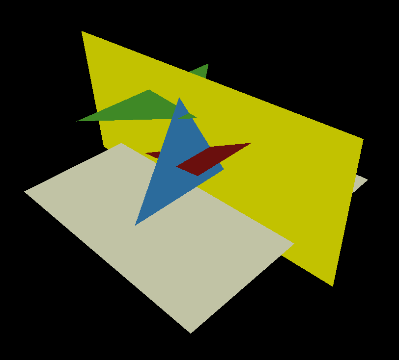

# Z - Buffer 技术原理与应用
## 一、Z - Buffer 概述
Z - Buffer 主要用于解决隐藏面移除过程中出现的视觉伪影问题。在图形渲染中，若按照画家算法进行绘制，即从后到前依次绘制三角形，理论上可实现正确渲染，但实际存在高计算成本的问题。每次相机移动都需重新对整个场景进行排序，且对于复杂场景，如存在相互交叉、遮挡关系复杂的三角形时，很难确定正确的绘制顺序。

## 二、从简单场景到 Y - buffer 原理
### （一）简单场景分析
考虑一个由三个三角形组成的简单场景，相机从上往下观察，将彩色三角形投影到白色屏幕上。在此场景中，如蓝色面与红色面的前后位置关系难以直接确定，若使用画家算法，需对蓝色面等进行复杂的分割和重排序，在包含数百万三角形的大型场景中，计算成本将变得极高。


渲染应该看起来像这样：


### （二）Y - buffer 实现
为简化问题，沿黄色平面切割上述场景，使其变为二维场景，由三条线段组成（黄色平面与每个三角形的交点），且最终渲染图像高度为 1 像素。




通过以下代码实现：
```cpp
{
    TGAImage scene(width, height, TGAImage::RGB);
    // 绘制场景中的线段
    line(Vec2i(20, 34), Vec2i(744, 400), scene, red);
    line(Vec2i(120, 434), Vec2i(444, 400), scene, green);
    line(Vec2i(330, 463), Vec2i(594, 200), scene, blue);
    // 绘制屏幕边界线
    line(Vec2i(10, 10), Vec2i(790, 10), scene, white);
    scene.flip_vertically(); 
    scene.write_tga_file("scene.tga");
}
```
在渲染过程中，声明一个 `ybuffer` 数组，其维度为（宽度，1），初始化为负无穷大。通过 `rasterize` 函数进行绘制，函数如下：
```cpp
void rasterize(Vec2i p0, Vec2i p1, TGAImage &image, TGAColor color, int ybuffer[]) {
    if (p0.x>p1.x) {
        std::swap(p0, p1);
    }
    for (int x=p0.x; x<=p1.x; x++) {
        float t = (x - p0.x)/(float)(p1.x - p0.x);
        int y = p0.y*(1. - t) + p1.y*t;
        if (ybuffer[x]<y) {
            ybuffer[x] = y;
            image.set(x, 0, color);
        }
    }
}
```
在 `rasterize` 函数中，遍历 `p0.x` 和 `p1.x` 之间的所有 `x` 坐标，计算线段对应的 `y` 坐标。然后比较当前 `y` 值与 `ybuffer` 数组中对应 `x` 索引处的值，若当前 `y` 值更接近相机（即更大），则在屏幕上绘制该点并更新 `ybuffer` 数组。


## 三、Z - Buffer 在 3D 场景中的应用
在 3D 场景中，要在 2D 屏幕上绘制，Z - Buffer 需要是二维的，可通过以下方式声明和转换：
```cpp
int *zbuffer = new int[width*height];
int idx = x + y*width;
int x = idx % width;
int y = idx / width;
```
在代码中，遍历所有三角形并调用 `triangle` 函数进行光栅化，关键在于计算要绘制像素的 `z` 值。在三角形光栅化中，采用重心坐标版本，对于每个要绘制的像素，将其重心坐标乘以光栅化三角形顶点的 `z` 值，`triangle` 函数实现如下：
```cpp
void triangle(Vec3f *pts, float *zbuffer, TGAImage &image, TGAColor color) {
    Vec2f bboxmin(std::numeric_limits<float>::max(), std::numeric_limits<float>::max());
    Vec2f bboxmax(-std::numeric_limits<float>::max(), -std::numeric_limits<float>::max());
    Vec2f clamp(image.get_width() - 1, image.get_height() - 1);
    for (int i = 0; i < 3; i++) {
        for (int j = 0; j < 2; j++) {
            bboxmin[j] = std::max(0.f, std::min(bboxmin[j], pts[i][j]));
            bboxmax[j] = std::min(clamp[j], std::max(bboxmax[j], pts[i][j]));
        }
    }
    Vec3f P;
    for (P.x = bboxmin.x; P.x <= bboxmax.x; P.x++) {
        for (P.y = bboxmin.y; P.y <= bboxmax.y; P.y++) {
            Vec3f bc_screen = barycentric(pts[0], pts[1], pts[2], P);
            if (bc_screen.x < 0 || bc_screen.y < 0 || bc_screen.z < 0) continue;
            P.z = 0;
            for (int i = 0; i < 3; i++) P.z += pts[i][2]*bc_screen[i];
            if (zbuffer[int(P.x + P.y*width)] < P.z) {
                zbuffer[int(P.x + P.y*width)] = P.z;
                image.set(P.x, P.y, color);
            }
        }
    }
```

## 四、纹理应用拓展
在 `.obj` 文件中，存在以 "vt u v" 开头的行，这些行给出了纹理坐标数组。面行 "f x/x/x x/x/x x/x/x" 中斜杠之间的中间数字是对应顶点的纹理坐标。通过在三角形内对纹理坐标进行插值，并乘以纹理图像的宽度和高度，可得到要放入渲染中的颜色，实现纹理映射效果。 